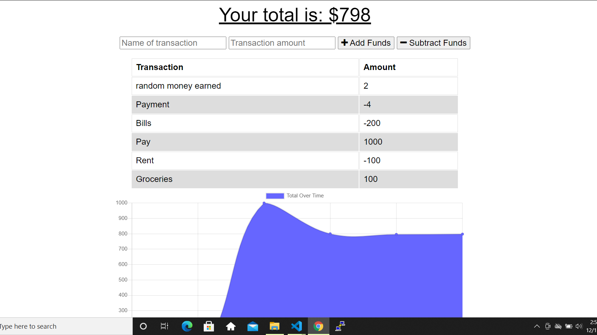

# Budget-Tracking

## Description
This tracks the user's deposites and expenses. When offline, deposites and expenses are able to be entered and when brought back online, ofline entries will be added to the tracker.

## Technologies Used
* Express
* MongoDb and Mongoose
* compression

## Picture of application

## Video walkthrough 

https://drive.google.com/file/d/1S5IX4txhWrIcS1P91Qiutr7BGPlqQIYg/view

## Link To deployed application

https://floating-savannah-93765.herokuapp.com/

